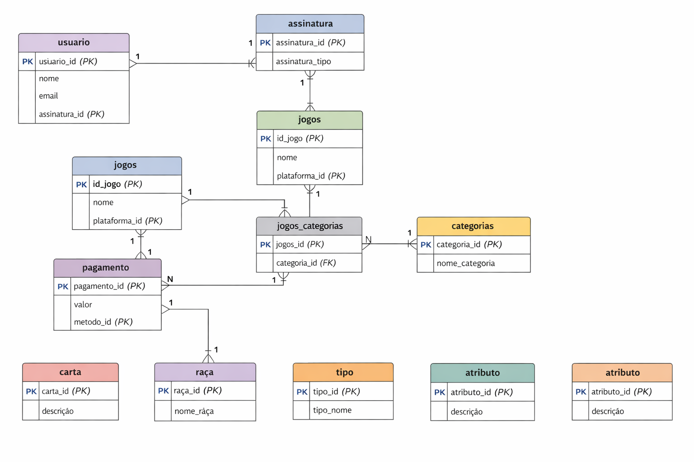

# Loja de Jogos Digitais - Banco de Dados

Este projeto apresenta a modelagem de um banco de dados para uma loja de jogos digitais.

## Tecnologias

- MySQL
- MySQL Workbench
- SQL

## Estrutura do projeto

database/
    loja_jogos_digitais.sql

queries/
    analises.sql

## Objetivo

Demonstrar conhecimentos em:

- modelagem de banco de dados
- SQL
- relacionamentos entre tabelas
- consultas analíticas
- SQL

- Este projeto utiliza:

- chaves primárias
- chaves estrangeiras
- índices para otimização
- tabelas de relacionamento (N:N)
- relacionamentos entre tabelas
- consultas analíticas

## Diagrama do Banco

